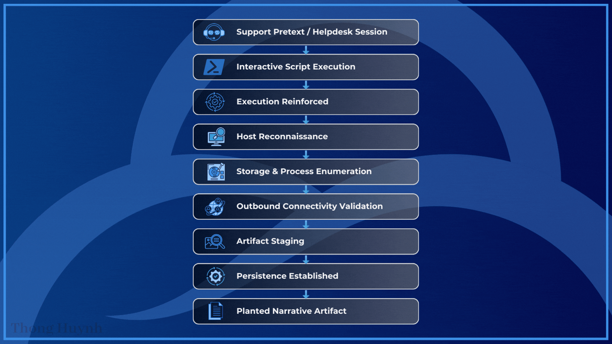

# Threat Hunt Report - Helpdesk Deception

- **Hunt Name:** The Helpdesk Deception
- **Author:** Thong Huynh
- **Date:** 2026-12-29
- **Environment:** Microsoft Sentinel + Defender for Endpoint
- **Hunt Type:** Hypothesis-Driven Threat Hunt
- **Severity:** Medium (Suspicious Activity Under Review)

## Executive Summary

Suspicious activity was observed on an intern workstation (`gab-intern-vm`) in early October 2025 during a session described as helpdesk support. The behavior deviated from standard support practices and showed a clear pattern of interactive system assessment, external reachability testing, and local preparation for follow-on activity.

The session ended with the creation of support-themed “records” that appear intended to legitimize the activity rather than document legitimate support work.

No disruption or confirmed exfiltration was observed, but the sequencing indicates unauthorized use of the system under a support pretext.

**Outcome:**  
- Unauthorized interactive activity identified  
- Persistence mechanism documented  
- No confirmed data exfiltration observed  

## Hunt Objective & Hypothesis

**Objective:**  
Determine whether activity attributed to a helpdesk troubleshooting session on **gab-intern-vm** represents legitimate support actions or unauthorized interactive behavior using a support pretext.

**Hypothesis:**  
If access was misused under the appearance of helpdesk support, then endpoint telemetry will show interactive, hands-on-keyboard behavior that deviates from standard support workflows. This includes PowerShell execution from user-writable locations, opportunistic discovery actions, outbound connectivity validation, local artifact staging, persistence mechanisms, and the creation of narrative artifacts intended to legitimize the activity.

## Data Sources

| Data Source            | Platform |
|------------------------|----------|
| DeviceProcessEvents    | Microsoft Defender for Endpoint |
| DeviceFileEvents       | Microsoft Defender for Endpoint |
| DeviceNetworkEvents    | Microsoft Defender for Endpoint |
| DeviceLogonEvents      | Microsoft Defender for Endpoint |

## Scope

- **Time Range:** `2025-10-09` (primary activity window), with analysis coverage through `2025-10-10` for validation
- **Assets in Scope:** Intern-operated workstations  
- **Primary Host:** gab-intern-vm  
- **Primary User Context:** g4bri3lintern
 
## Methodology

This hunt followed a **timeline-driven, behavior-first approach**:

1. Identified the most suspicious endpoint based on shared file traits and execution patterns  
2. Anchored the investigation on the earliest anomalous execution event  
3. Tracked parent–child process relationships to understand execution flow  
4. Correlated process, file, and network activity to reconstruct the session  
5. Evaluated actions in sequence to distinguish legitimate support behavior from misuse  
6. Assessed intent based on ordering, context, and persistence-related artifacts  

Early queries were intentionally broad to establish context before narrowing into specific behaviors and artifacts.

## Investigation Timeline

| Timestamp (UTC)           | Event                                                                                                                               |
| ------------------------- | ----------------------------------------------------------------------------------------------------------------------------------- |
| 2025-10-09 12:22          | PowerShell runs a support-themed script from Downloads with execution policy bypass; script review observed.                        |
| 2025-10-09 12:23          | Script re-invoked with process-scope bypass behavior (interactive execution continues).                                             |
| 2025-10-09 12:34          | Defender-themed artifact recorded in Recent Items (`DefenderTamperArtifact.lnk`).                                                   |
| 2025-10-09 12:50 to 12:52 | Recon sequence: clipboard probe, user/session checks, disk enumeration, DNS check, process inventory, privilege context validation. |
| 2025-10-09 12:55          | Outbound connectivity validated (`www.msftconnecttest.com`).                                                                        |
| 2025-10-09 12:58 to 12:59 | Archive staged: `ReconArtifacts.zip` created/handled; Recycle Bin `$I`/`$R` patterns observed.                                      |
| 2025-10-09 13:00          | Additional egress tests to external destinations (`example.com`, `httpbin.org`).                                                    |
| 2025-10-09 13:01          | Scheduled task `SupportToolUpdater` created and queried (persistence established).                                                  |
| 2025-10-09 13:02 to 13:03 | Narrative artifacts created: `SupportChat_log.lnk` then `SupportChat_log.txt` in Downloads.                                         |


## Key Findings

The following findings summarize the observed behaviors that, when viewed in sequence, demonstrate misuse of access under the appearance of routine helpdesk activity.

### Interactive Execution Masquerading as Support Activity
- PowerShell executed a support-themed script from a user-writable Downloads path using execution policy bypass, consistent with hands-on interactive execution rather than managed helpdesk tooling.

### Progressive Host Reconnaissance
- Rapid sequence of user/session checks, storage enumeration, process inventory, and privilege context validation indicates deliberate environment assessment.

### Outbound Connectivity Validation and Artifact Staging
- External reachability was validated (multiple destinations), followed by creation and handling of a staged archive (`ReconArtifacts.zip`), consistent with preparation for potential transfer.

### Persistence Established
- A scheduled task (`SupportToolUpdater`) was created for logon execution and immediately queried, indicating intent to re-run beyond the initial session.

### Planted Narrative Artifact
- `SupportChat_log.*` artifacts were created near the end of the window, consistent with an attempted justification trail rather than normal support documentation.

## MITRE ATT&CK Mapping

The observed behaviors were mapped to MITRE ATT&CK techniques to contextualize the activity within known adversary tradecraft and support consistent reporting and detection tuning.

| Tactic              | Technique                                | ID        |
|---------------------|-------------------------------------------|-----------|
| Execution           | Command and Scripting Interpreter (PowerShell) | T1059.001 |
| Discovery           | System Information Discovery               | T1082     |
| Discovery           | Process Discovery                          | T1057     |
| Discovery           | Permission Groups Discovery                | T1069     |
| Collection          | Clipboard Data                             | T1115     |
| Exfiltration Prep   | Archive Collected Data                     | T1560     |
| Persistence         | Scheduled Task / Job                       | T1053     |
| Defense Evasion     | Masquerading                               | T1036     |

## Indicators of Compromise (IOCs)

The following indicators were identified during the investigation and may be used for scoping, correlation, and detection tuning. These IOCs should be evaluated in context, as some artifacts may be benign in isolation.

| Type           | Value |
|----------------|-------|
| Hostname       | gab-intern-vm |
| Account Name   | g4bri3lintern |
| File Name      | DefenderTamperArtifact.lnk |
| File Name      | SupportChat_log.lnk |
| Archive        | ReconArtifacts.zip |
| Scheduled Task | SupportToolUpdater |
| Process        | powershell.exe |
| Process        | tasklist.exe |
| Network Domain | www.msftconnecttest.com |
| Remote IP      | 100.29.147.161 |

## Response Actions

- Validate and remove scheduled task `SupportToolUpdater`
- Collect and preserve `SupportTool.ps1`, `ReconArtifacts.zip`, and `SupportChat_log.*` artifacts
- Review the user account activity and reset credentials if warranted
- Increase monitoring for PowerShell execution from user-writable paths on intern endpoints

## Detection Gaps & Improvements

The activity did not trigger high-confidence alerts because individual actions resembled benign support behavior when viewed in isolation. Key gaps included limited visibility into interactive PowerShell use from user-writable paths, weak correlation across short recon sequences, and persistence mechanisms that blended in through familiar naming.

**Improvements:**
- Add behavioral detections for interactive PowerShell execution from Downloads and similar paths  
- Correlate recon-style command sequences within short time windows  
- Alert on support-themed persistence mechanisms on non-IT endpoints  

## Lessons Learned

- Support-themed activity can be used as effective cover for interactive misuse  
- Sequencing and timing of actions provided clearer signal than any single event  
- Narrative artifacts can be as telling as technical artifacts when correlated properly  
- Intern-operated systems remain attractive targets due to lower scrutiny and expectations  

## Recommendations

- Restrict interactive PowerShell execution from user-writable locations on non-IT endpoints  
- Enforce approved helpdesk tooling and block ad-hoc “support” scripts from Downloads directories  
- Increase monitoring and correlation for short-lived recon sequences followed by persistence actions  
- Review intern workstation access models and apply additional guardrails and logging  
- Use narrative-style artifacts (support logs, notes) as investigative signals when correlated with technical activity  

<details>
<summary><h2><strong>Appendix: Supporting Queries and Evidence (click to expand)</strong></h2></summary>

The following sections document the investigative queries used during the hunt, along with the corresponding evidence observed in endpoint telemetry to support each finding.

### Finding: Support-Themed Execution on Intern Workstation

```kql
let start = datetime(2025-10-09);
let end   = datetime(2025-10-10);
DeviceProcessEvents
| where TimeGenerated between (start .. end)
| where FolderPath has @"\Downloads\"
   or ProcessCommandLine has @"\Downloads\"
   or InitiatingProcessCommandLine has @"\Downloads\"
| where ProcessCommandLine contains "support"
   or InitiatingProcessCommandLine contains "support"
| project TimeGenerated, DeviceName, AccountName, ProcessCommandLine, FileName, FolderPath, InitiatingProcessCommandLine
| order by TimeGenerated asc
```
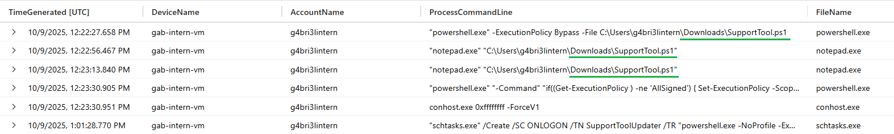

**Evidence observed:**  
Support-related processes were executed from the Downloads directory on gab-intern-vm.

**Why it matters:**  
Helpdesk tooling is rarely executed from Downloads, indicating interactive, non-standard behavior.

---

### Finding: PowerShell Execution Policy Manipulation

```kql
let start = datetime(2025-10-01);
let end   = datetime(2025-10-16);
DeviceProcessEvents
| where TimeGenerated between (start .. end)
| where tolower(AccountName) !in ("system", "local service", "network service")
| where DeviceName == "gab-intern-vm"
| where InitiatingProcessCommandLine has "powershell" or ProcessCommandLine has "powershell"
| project TimeGenerated, DeviceName, ProcessCommandLine, InitiatingProcessFileName, InitiatingProcessCommandLine
| order by TimeGenerated asc
```

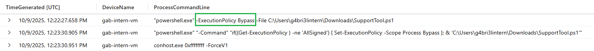

**Evidence observed:**  
PowerShell was executed with the -ExecutionPolicy parameter early in the session.

**Why it matters:**  
ExecutionPolicy manipulation enables ad-hoc or unsigned script execution.

---

### Finding: Defender-Themed Artifact Interaction

```kql
let start = datetime(2025-10-09T12:22:27.6588913Z);
let end   = datetime(2025-10-10);
DeviceFileEvents
| where TimeGenerated between (start .. end)
| where DeviceName == "gab-intern-vm"
| where tolower(InitiatingProcessAccountName) !in ("system", "local service", "network service")
| where InitiatingProcessFileName has "explorer"
| project TimeGenerated, DeviceName, ActionType, FileName, FolderPath, InitiatingProcessAccountName
| order by TimeGenerated asc
```

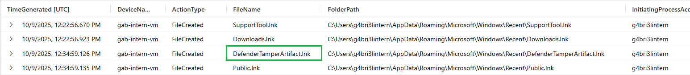

**Evidence observed:**  
DefenderTamperArtifact.lnk was manually accessed via Explorer.

**Why it matters:**  
Tamper-themed artifacts often signal intent to probe or imply security changes.

---

### Finding: Opportunistic Clipboard Access

```kql
let start = datetime(2025-10-09T12:22:27.6588913Z);
let end   = datetime(2025-10-10);
DeviceProcessEvents
| where TimeGenerated between (start .. end)
| where tolower(AccountName) !in ("system", "local service", "network service")
| where DeviceName == "gab-intern-vm"
| where InitiatingProcessCommandLine has "powershell" or ProcessCommandLine has "powershell"
| where ProcessCommandLine contains "clip"
| project TimeGenerated, DeviceName, AccountName, ProcessCommandLine, InitiatingProcessFileName, InitiatingProcessCommandLine
| order by TimeGenerated asc
```

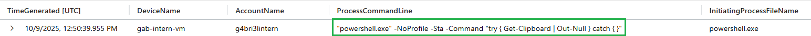

**Evidence observed:**  
PowerShell attempted to read clipboard contents without producing output.

**Why it matters:**  
Clipboard access is a low-effort probe for immediately available sensitive data.

---

### Finding: Active Session Enumeration

```kql
let start = datetime(2025-10-09T12:22:27.6588913Z);
let end   = datetime(2025-10-10);
DeviceProcessEvents
| where TimeGenerated between (start .. end)
| where tolower(AccountName) !in ("system", "local service", "network service")
| where DeviceName == "gab-intern-vm"
| where InitiatingProcessCommandLine has "query"
| project TimeGenerated, DeviceName, AccountName, FileName, ProcessCommandLine, InitiatingProcessFileName, InitiatingProcessCommandLine
| order by TimeGenerated asc
```

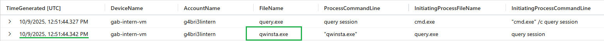

**Evidence observed:**  
qwinsta.exe was executed to enumerate active sessions.

**Why it matters:**  
Session awareness informs timing and stealth of follow-on actions.

---

### Finding: Local Storage Enumeration

```kql
let start = datetime(2025-10-09T12:22:27.6588913Z);
let end   = datetime(2025-10-10);
DeviceProcessEvents
| where TimeGenerated between (start .. end)
| where tolower(AccountName) !in ("system", "local service", "network service")
| where DeviceName == "gab-intern-vm"
| where ProcessCommandLine contains "disk"
| project TimeGenerated, DeviceName, AccountName, FileName, ProcessCommandLine, InitiatingProcessFileName, InitiatingProcessCommandLine
| order by TimeGenerated asc
```

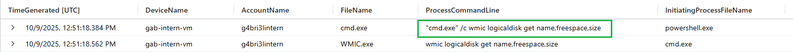

**Evidence observed:**  
Local disks and available free space were enumerated.

**Why it matters:**  
Storage mapping is a preparatory step for data collection and staging.

---

### Finding: Connectivity and Name Resolution Checks

```kql
let start = datetime(2025-10-09T12:22:27.6588913Z);
let end   = datetime(2025-10-10);
DeviceProcessEvents
| where TimeGenerated between (start .. end)
| where tolower(AccountName) !in ("system", "local service", "network service")
| where DeviceName == "gab-intern-vm"
| where InitiatingProcessCommandLine has "nslookup" or ProcessCommandLine has "nslookup"
| project TimeGenerated, DeviceName, AccountName, FileName, ProcessCommandLine, InitiatingProcessFileName, InitiatingProcessCommandLine
| order by TimeGenerated asc
```
```kql
let mytime = datetime('2025-10-09T12:51:32.5900538Z');
DeviceNetworkEvents
| where TimeGenerated between ((mytime - 5m) .. (mytime + 5m))
| where DeviceName == "gab-intern-vm"
| where tolower(InitiatingProcessAccountName) !in ("system", "local service", "network service")
| where isnotempty( InitiatingProcessParentFileName)
| where InitiatingProcessCommandLine has "powershell"
| project TimeGenerated, DeviceName, InitiatingProcessParentFileName, RemoteIP, RemotePort, RemoteUrl, Protocol
| order by TimeGenerated asc
```

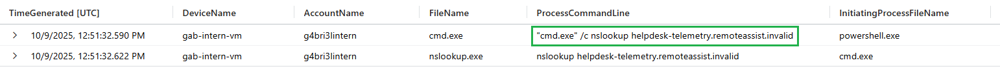
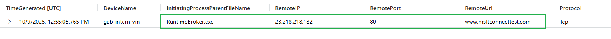

**Evidence observed:**  
Name resolution and outbound connectivity checks were observed during the session.

**Why it matters:**  
Outbound validation is a prerequisite for data staging or transfer.

---

### Finding: Interactive Session Discovery

```kql
let start = datetime(2025-10-09T12:22:27.6588913Z);
let end   = datetime(2025-10-10);
DeviceProcessEvents
| where TimeGenerated between (start .. end)
| where tolower(AccountName) !in ("system", "local service", "network service")
| where DeviceName == "gab-intern-vm"
| where InitiatingProcessCommandLine contains "quser" or ProcessCommandLine contains "quser"
| where InitiatingProcessCommandLine has "powershell" or ProcessCommandLine has "powershell"
| project TimeGenerated, DeviceName, AccountName, FileName, ProcessCommandLine, InitiatingProcessUniqueId
| order by TimeGenerated asc
```

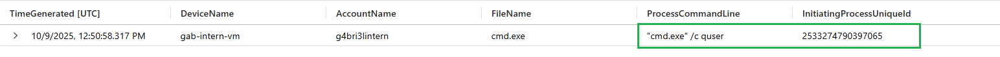

**Evidence observed:**  
quser was executed to enumerate logged-in users.

**Why it matters:**  
Indicates interactive presence rather than automated tooling.

---

### Finding: Runtime Process Enumeration

```kql
let start = datetime(2025-10-09T12:22:27.6588913Z);
let end   = datetime(2025-10-10);
DeviceProcessEvents
| where TimeGenerated between (start .. end)
| where tolower(AccountName) !in ("system", "local service", "network service")
| where DeviceName == "gab-intern-vm"
| where InitiatingProcessCommandLine contains "tasklist"
| project TimeGenerated, DeviceName, AccountName, FileName, InitiatingProcessCommandLine, ProcessCommandLine, InitiatingProcessFileName
| order by TimeGenerated asc
```

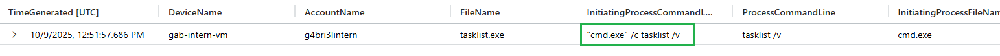

**Evidence observed:**  
tasklist.exe was executed to inventory running processes.

**Why it matters:**  
Process inventories reveal active applications and security controls.

---

### Finding: Privilege Context Assessment

```kql
let start = datetime(2025-10-09T12:22:27.6588913Z);
let end   = datetime(2025-10-10);
DeviceProcessEvents
| where TimeGenerated between (start .. end)
| where tolower(AccountName) !in ("system", "local service", "network service")
| where DeviceName == "gab-intern-vm"
| where ProcessCommandLine has "whoami"
| where InitiatingProcessCommandLine has "powershell" or ProcessCommandLine has "powershell"
| project TimeGenerated, DeviceName, AccountName, FileName, ProcessCommandLine, InitiatingProcessFileName, InitiatingProcessCommandLine, InitiatingProcessUniqueId
| order by TimeGenerated asc
```

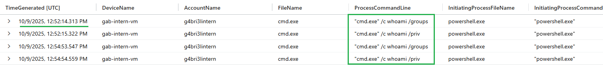

**Evidence observed:**  
whoami was executed to confirm account context.

**Why it matters:**  
Privilege awareness informs escalation decisions.

---

### Finding: Outbound Connectivity Validation

```kql
let start = datetime(2025-10-09T12:22:27.6588913Z);
let end   = datetime(2025-10-10);
DeviceNetworkEvents
| where TimeGenerated between (start .. end)
| where DeviceName == "gab-intern-vm"
| where tolower(InitiatingProcessAccountName) !in ("system", "local service", "network service")
| where tolower(InitiatingProcessAccountName) in ("g4bri3lintern")
//| where InitiatingProcessAccountName == ""
| where InitiatingProcessFileName has "powershell"
| project TimeGenerated, DeviceName, InitiatingProcessAccountName, RemoteUrl, RemoteIP, RemotePort, Protocol
| order by TimeGenerated asc
```

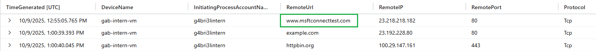

**Evidence observed:**  
Connection to www.msftconnecttest.com  
was observed.

**Why it matters:**  
Validates ability to reach external endpoints.

---

### Finding: Artifact Bundling and Staging

```kql
let start = datetime(2025-10-09T12:22:27.6588913Z);
let end   = datetime(2025-10-10);
DeviceFileEvents
| where TimeGenerated between (start .. end)
| where DeviceName == "gab-intern-vm"
| where InitiatingProcessAccountName == "g4bri3lintern"
| where FileName has "zip"
| project TimeGenerated, ActionType, DeviceName, FolderPath, FileName, InitiatingProcessCommandLine
| order by TimeGenerated asc
```

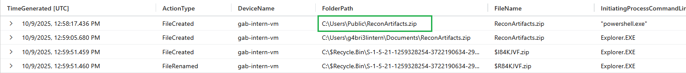

**Evidence observed:**  
ReconArtifacts.zip was created in a public directory.

**Why it matters:**  
Staging signals preparation beyond reconnaissance.

---

### Finding: Simulated Outbound Transfer Attempt

```kql
let start = datetime(2025-10-09T12:22:27.6588913Z);
let end   = datetime(2025-10-10);
DeviceNetworkEvents
| where TimeGenerated between (start .. end)
| where DeviceName == "gab-intern-vm"
| where tolower(InitiatingProcessAccountName) !in ("system", "local service", "network service")
| where tolower(InitiatingProcessAccountName) in ("g4bri3lintern")
| where InitiatingProcessFileName has "powershell"
| project TimeGenerated, DeviceName, InitiatingProcessAccountName, InitiatingProcessFileName, RemoteIP, RemotePort, RemoteUrl, Protocol
| order by TimeGenerated desc
```

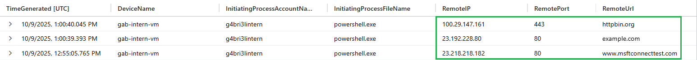

**Evidence observed:**  
Outbound connection to external IP address 100.29.147.161 was observed.

**Why it matters:**  
Attempted transfer demonstrates intent regardless of success.

---

### Finding: Scheduled Task Persistence

```kql
let start = datetime(2025-10-09T12:22:27.6588913Z);
let end   = datetime(2025-10-10);
DeviceProcessEvents
| where TimeGenerated between (start .. end)
| where tolower(AccountName) !in ("system", "local service", "network service")
| where DeviceName == "gab-intern-vm"
| where ProcessCommandLine has "schtasks.exe"
| where InitiatingProcessCommandLine has "powershell" or ProcessCommandLine has "powershell"
| project TimeGenerated, DeviceName, AccountName, ProcessCommandLine, InitiatingProcessFileName
| order by TimeGenerated asc
```

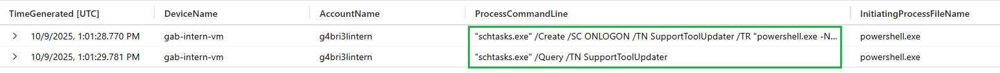

**Evidence observed:**  
Scheduled task named SupportToolUpdater was created.

**Why it matters:**  
Scheduled tasks provide durable persistence beyond a single session.

---

### Finding: Planted Support Narrative Artifact

```kql
let start = datetime('2025-10-09T12:59:51.4603702Z');
let end   = datetime(2025-10-10);
DeviceFileEvents
| where TimeGenerated between (start .. end)
| where DeviceName == "gab-intern-vm"
| where InitiatingProcessAccountName == "g4bri3lintern"
| where InitiatingProcessCommandLine has "explorer"
| project TimeGenerated, DeviceName, ActionType, FileName, FolderPath
| order by TimeGenerated asc
```

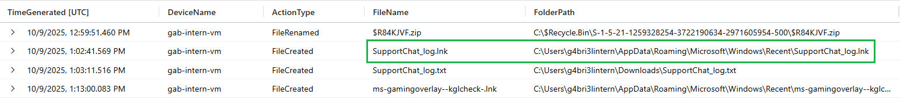

**Evidence observed:**  
SupportChat_log.lnk was created and accessed during the suspicious activity window.

**Why it matters:**  
Narrative artifacts are commonly used to justify or mask misuse of access.

</details>
